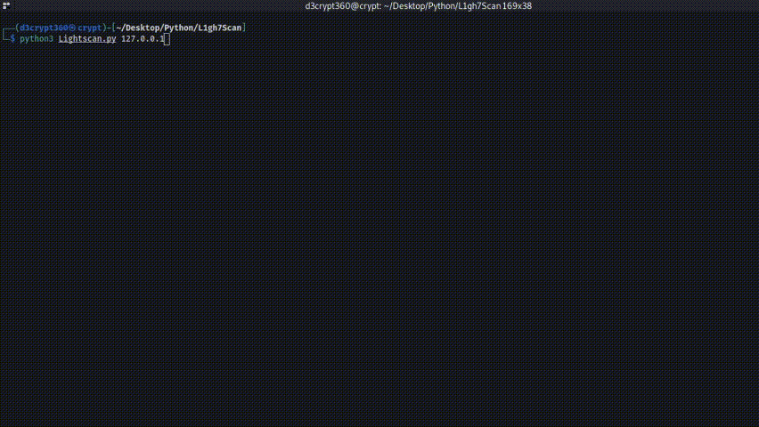

# **L1gh7Scan**
This is a portscanner coded with python 
And it comes close to rustscan **IN TERMS OF SPEED NOT FUNCTIONALITY!!!**

# **Python version**
- Python 3.6 +

# **Installation**

1 - Clone the github repository

```
$ git clone https://github.com/git-SwitchBlade/L1gh7Scan.git
```

2 - Run the script and enjoy.

```
$ python3 Lightscan.py <ip address>
```

# **Issues**

If you find an error or can't seem to run create an [issue](https://github.com/git-SwitchBlade/L1gh7Scan/issues/new).

# **Legal**
This tool is intended for educational purposes only. The repo owner nor the contributors to this project will **NOT** take any responsibilty for any issues caused by malicious useage of this tool.
# **Thanks**
Special Thanks To 
Decrypt and Hackername
